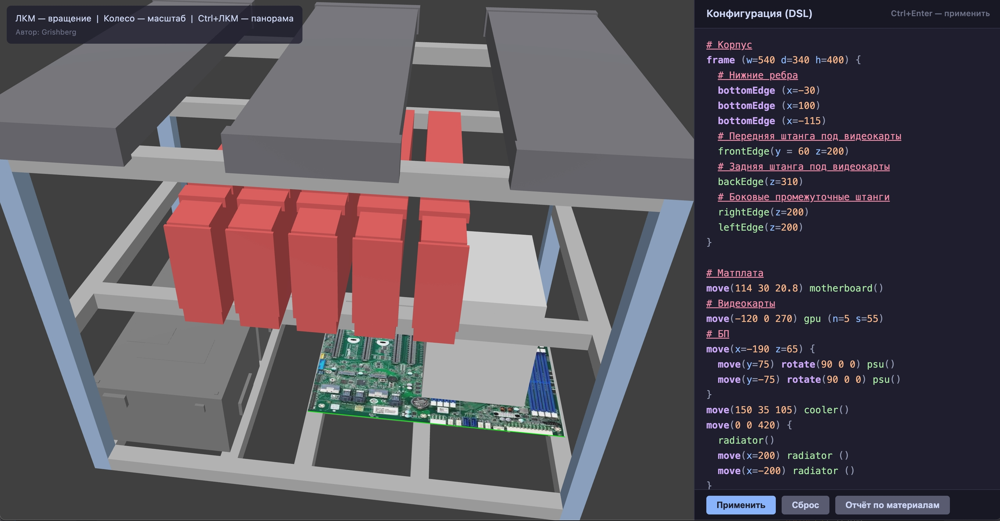

# 3D Viewer корпуса ПК (pc_viewer_3d)

Веб-просмотрщик корпуса ПК, собранного из алюминиевого профиля 20×20 мм с компонентами
(материнская плата, GPU, БП, кулер, радиаторы). Конфигурация задаётся текстовым DSL
— синтаксис совместим с парсером проекта `csg_pc_editor` (Android/desktop).



## Запуск

Требования: Node.js 18+.

```bash
npm install          # зависимости

# dev-режим (Vite, HMR) — http://localhost:5173/
npm run dev

# dev на другом порту, например 8888
npx vite --port 8888 --host

# production: сборка в dist/ и предпросмотр
npm run build
npx vite preview --port 8888 --host
```

Тесты парсера DSL (не нужны для запуска, проверяют корректность):

```bash
npx tsx test_dsl.ts
```

## Как пользоваться

Интерфейс: слева — 3D-сцена, справа — редактор DSL и кнопки.

**Мышь:**
- ЛКМ (перетаскивание) — вращение камеры
- колесо — масштаб
- Ctrl+ЛКМ — панорама сцены
- `R` — сброс камеры в исходное положение
- `Tab` в редакторе — вставляет два пробела (не переключает фокус)

Скрипт автоматически сохраняется в localStorage браузера при каждом успешном
«Применить» и подгружается после перезапуска сервиса/обновления страницы.

**Кнопки панели:**
- **Применить** (`Ctrl+Enter`) — разобрать скрипт, перестроить сцену и сохранить
  скрипт (переживёт перезапуск). Ошибки парсера показываются красной плашкой над
  кнопками; текст скрипта при этом не изменяется и сохранённая копия не затирается.
- **Сброс** — вернуть дефолтный скрипт целиком (рамка `w=540 d=340 h=400` со всеми
  компонентами) и очистить сохранение, так что после перезапуска снова будет он.
- **Отчёт по материалам** — показать спецификацию нарезки профиля: длина каждого
  вида куска, количество штук по осям X/Y/Z, всего кусков/резов и общая длина в мм и метрах.
  Отчёт можно скачать файлом `profile_report.txt` (полезно для заказа алюминиевого профиля).

## Синтаксис DSL

```
# комментарий (также поддерживается //)
frame (w=540 d=340 h=400) {            # рамка: ширина/глубина/высота
  bottomEdge(x=-40)                    # дополнительные нижние балки по Y
  bottomEdge(x=100)
  frontEdge(z=170 x=-50 y=10 l=300)    # промежуточные балки (см. ниже)
  backEdge(z=170)
}

move(114 30 20.8) motherboard()        # компонент после цепочки transform'ов
move(-120 0 270) gpu (n=5 s=55)        # n — количество, s — шаг между GPU

move(x=-170 z=80) {                    # блок: вложенные строки наследуют move(...)
  move(y=75)  rotate(90 0 0) psu()     # именованные параметры x=/y=/z=
  move(y=-75) rotate(90 0 0) psu()
}

move(150 35 105) cooler()
move(0 0 420) {
  radiator()                           # без transform — на месте блока
  move(x=200) radiator ()
}
```

### Объявление рамки `frame(w=… d=… h=…)`

| Параметр | Обяз. | Описание |
|----------|-------|----------|
| `w` | да | ширина корпуса по X, мм |
| `d` | да | глубина корпуса по Y, мм |
| `h` | да | высота корпуса по Z, мм (низ — z=0) |

Нижние балки задаются строками `bottomEdge(x=…)` — как блоком в `frame(...)`, так и
отдельными строками (в т.ч. вне блока рамки). Старые параметры `b=` и `l=` больше не
поддерживаются: полоса на одной высоте собирается из отдельных промежуточных балок
(`frontEdge`/`backEdge`/`leftEdge`/`rightEdge`).

### Промежуточные балки

| Функция | Балка | Обязательный параметр | Необязательные параметры |
|---------|-------|----------------------|--------------------------|
| `frontEdge(z=…)` | вдоль X у **передней** стенки (y = −d/2) | `z` — высота, мм | `x` — смещение от центра по X (default 0); `y` — сдвиг вдоль Y от стенки внутрь корпуса (default 0); `l` — длина палки (default вся ширина: w−40мм) |
| `backEdge(z=…)` | то же у **задней** стенки (y = +d/2) | `z` | те же (`y` считается от задней стенки, положительный сдвиг — в сторону центра) |
| `leftEdge(z=…)` | вдоль Y у левой стенки | `z` | длина фиксирована: d−40мм |
| `rightEdge(z=…)` | вдоль Y у правой стенки | `z` | длина фиксирована: d−40мм |

Полка-пояс на высоте Z = четыре балки одной высоты, например:
`frontEdge(z=170) backEdge(z=170) leftEdge(z=170) rightEdge(z=170)`.

Объявлять можно где угодно: отдельными строками, в блоке `frame { … }`, даже внутри
transform-блоков — балки относятся к рамке целиком (объединяющий move() на них не влияет).
Передняя стенка — та, что смотрит на наблюдателя по умолчанию.

### Transform'ы

- `move(x y z)` — позиционные аргументы, либо именованные: `move(x=-170 z=80)`
  (пропущенные координаты = 0).
- `rotate(rx ry rz)` — поворот в градусах вокруг осей X/Y/Z, синтаксис тот же.
- Transform'ы можно цеплять: `move(…) rotate(… …) компонент()`; порядок применения —
  как в csg_pc_editor (поворот к геометрии, затем смещение).

### Блоки `{ }`

Цепочка transform'ов + фигурные скобки образуют блок: все компоненты внутри наследуют
внешние transform'ы. Вложенность не ограничена:

```
move(z=420) {            # общий подъём радиаторов
  radiator()
  move(x=200) radiator() # дополнительно сдвинут по X
}
```

### Компоненты

| Имя | Параметры | Модель |
|-----|-----------|--------|
| `motherboard()` | — | материнская плата (Tyan S8030, 305×206 мм), верх/низ текстурированы как в Android-версии |
| `gpu(n=… s=…)` | `n` — кол-во (по умолчанию 1), `s` — шаг, мм (по умолч. 50) | RTX 3090 Turbo |
| `psu()` | — | БП ATX с рейлами |
| `cooler()` | — | CPU кулер |
| `radiator()` | — | радиатор 120×395 мм (ориентация задаётся rotate) |

### Примеры ошибок парсера

- `Не найдено объявление frame` — в скрипте нет `frame(...)`
- `Дублирующее объявление frame` — две рамки
- `Отсутствует параметр 'w'` / `Ожидалось значение после '='`
- `Неожиданный символ ',' в позиции 42`
- `frame нельзя объявлять внутри блока`

## Структура проекта

```
index.html        страница (Canvas + панель DSL, модалка отчёта)
src/main.ts       Three.js сцена, UI, подсветка синтаксиса
src/dsl.ts        токенизатор/парсер/интерпретатор DSL (как в csg_pc_editor)
src/profiles.ts   расчёт нарезки профиля и спецификация материалов
src/components.ts геометрия рамки и компонентов (CSG via three-csg-ts)
src/scene.ts      сборка мешей сцены из SceneConfig
public/textures/  текстуры материнской платы (из csg_pc_editor)
docs/screenshot.jpg скриншот приложения (в этом README)
test_dsl.ts       тесты парсера (npx tsx test_dsl.ts)
```
